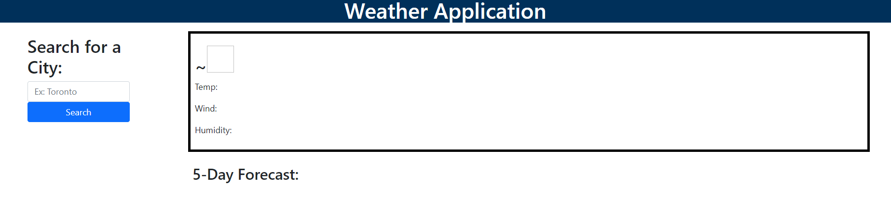

# Weather Dashboard Application
## Table of Contents
- [Description](#description)
- [What was learned?](#what-was-learned)
- [Website](#website)
- [Credits](#credits)
 

## Description
This is a weather app created using HTML, CSS, Bootstrap 5 and jQuery. The user inputs any city in the world and is given the current Weather, including details such as Temperature, Wind, Humidity and the 5-Day Forecast.
 

## What was learned?
While working on this I learned how to use Bootstrap framework to easily create a very fluid designed webpage. I had also learned how to dynamically create buttons for search history using the Local Storage values from the user.
 

## Website
[The link to the deployed webpage can be found here](https://angadbatth.github.io/weather-app/)

 

## Credits

[W3 Form Input Types](https://www.w3schools.com/html/html_form_input_types.asp)  
[Mozilla aria](https://developer.mozilla.org/en-US/docs/Web/Accessibility/ARIA/Attributes/aria-describedby)  
[Mozilla Developer](https://developer.mozilla.org/en-US/)  
[W3 Schools](https://www.w3schools.com/)  
[Stack Overflow](https://stackoverflow.com/)  
Daler Singh  
Adam Nyx